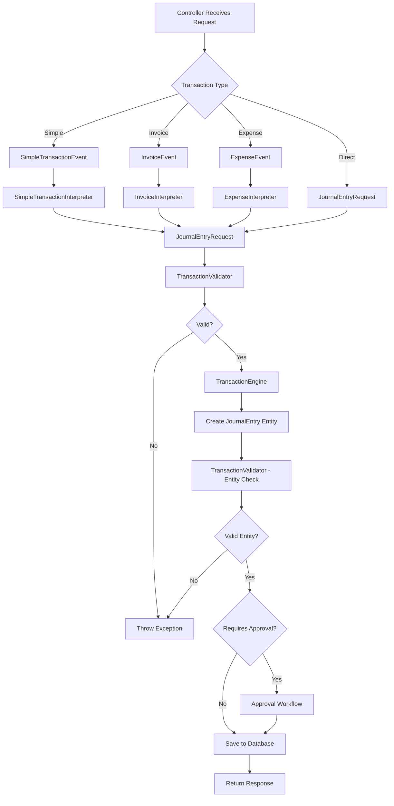
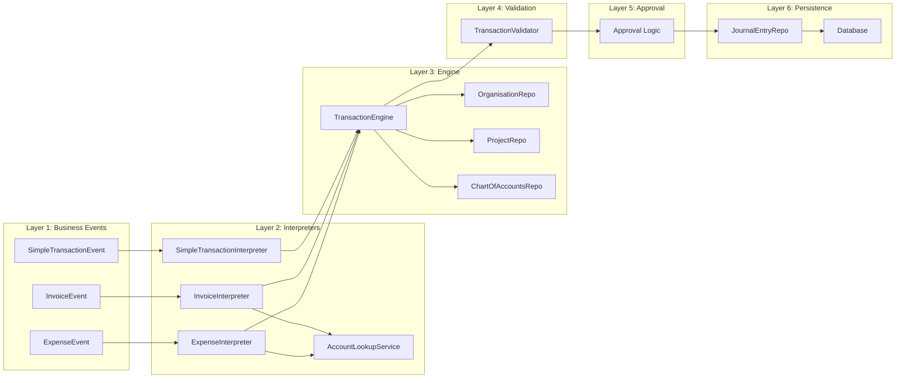
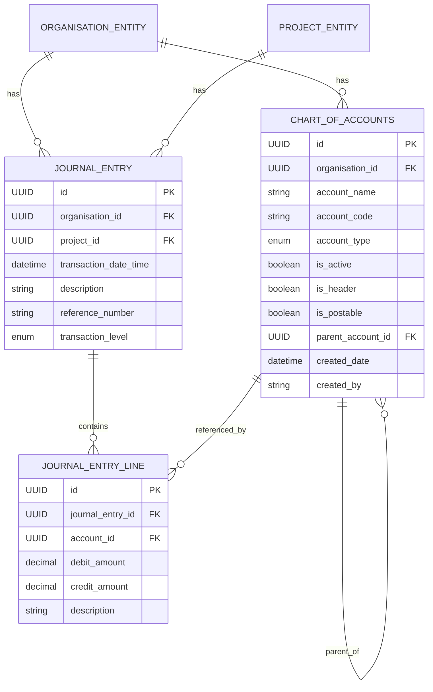

# BuildWise Accounting Architecture Analysis

## 🏗️ Overall Architecture Overview

Your accounting system follows a **6-Layer Transaction Architecture** with excellent separation of concerns:

```
┌─────────────────────────────────────────────────────────────┐
│                    LAYER 1: Business Events                 │
│  (What happened in business terms - Invoice, Expense, etc.) │
└─────────────────────────────────────────────────────────────┘
                                ↓
┌─────────────────────────────────────────────────────────────┐
│               LAYER 2: Business Event Interpreters          │
│     (Convert business events to accounting language)        │
└─────────────────────────────────────────────────────────────┘
                                ↓
┌─────────────────────────────────────────────────────────────┐
│               LAYER 3: Transaction Engine                   │
│        (Create JournalEntry entities from requests)         │
└─────────────────────────────────────────────────────────────┘
                                ↓
┌─────────────────────────────────────────────────────────────┐
│               LAYER 4: Transaction Validator                │
│         (Ensure accounting rules and data integrity)        │
└─────────────────────────────────────────────────────────────┘
                                ↓
┌─────────────────────────────────────────────────────────────┐
│               LAYER 5: Approval System                      │
│      (Handle approval workflows for large transactions)     │
└─────────────────────────────────────────────────────────────┘
                                ↓
┌─────────────────────────────────────────────────────────────┐
│               LAYER 6: Database Persistence                 │
│           (Save validated entries to database)              │
└─────────────────────────────────────────────────────────────┘
```

## 📊 Data Flow Diagram

### High-Level Transaction Flow



### Detailed Component Interaction



## 🗄️ Database Schema Architecture

### Core Accounting Entities



## 🔄 Transaction Processing Patterns

### 1. **Strategy Pattern Implementation**
```
BusinessEventInterpreter<T> (Interface)
├── SimpleTransactionInterpreter
├── InvoiceInterpreter
└── ExpenseInterpreter
```

### 2. **Factory Pattern for Account Lookup**
```
AccountLookupService
├── getCashAccountId()
├── getAccountsReceivableAccountId()
├── getAccountsPayableAccountId()
└── getTaxPayableAccountId()
```

### 3. **Template Method Pattern in Validation**
```
TransactionValidator
├── validateJournalEntry(Request)
├── validateJournalEntry(Entity)
└── ValidationResult
```

## 🎯 Best Practices Implemented

### ✅ **Excellent Practices in Your Code:**

1. **Double-Entry Bookkeeping Enforcement**
    - Validator ensures debits = credits
    - No transaction without balanced entries

2. **Domain-Driven Design (DDD)**
    - Clear business events (Invoice, Expense)
    - Rich domain models with business logic

3. **SOLID Principles**
    - Single Responsibility: Each interpreter handles one event type
    - Open/Closed: Easy to add new transaction types
    - Dependency Inversion: Interfaces for all services

4. **Transaction Integrity**
    - Database transactions ensure ACID properties
    - Comprehensive validation at multiple layers

5. **Audit Trail**
    - Complete transaction history
    - Reference numbers for tracking
    - Created/modified timestamps

6. **Hierarchical Chart of Accounts**
    - Supports complex accounting structures
    - Header vs postable accounts
    - Parent-child relationships

### 🔧 **Architectural Strengths:**

1. **Separation of Concerns**
   ```
   Business Logic ≠ Accounting Logic ≠ Persistence Logic
   ```

2. **Extensibility**
    - Easy to add new transaction types
    - New interpreters can be plugged in

3. **Testability**
    - Each layer can be unit tested independently
    - Mocking is straightforward

4. **Multi-tenant Support**
    - Organisation-level isolation
    - Project-level granularity

## 🚀 Suggested Enhancements

### 1. **Add Event Sourcing Pattern**
```java
@Entity
public class AccountingEvent {
    private UUID eventId;
    private String eventType;
    private String eventData;
    private LocalDateTime timestamp;
    private UUID aggregateId;
}
```

### 2. **Implement CQRS (Command Query Responsibility Segregation)**
```java
// Command Side
public interface TransactionCommandService {
    void processTransaction(BusinessEvent event);
}

// Query Side  
public interface TransactionQueryService {
    List<TransactionSummary> getTransactionHistory();
    BalanceSheet generateBalanceSheet();
}
```

### 3. **Add Workflow Engine for Complex Approvals**
```java
@Entity
public class ApprovalWorkflow {
    private UUID workflowId;
    private List<ApprovalStep> steps;
    private ApprovalStatus status;
}
```

### 4. **Implement Saga Pattern for Multi-Step Transactions**
```java
public class TransactionSaga {
    private List<TransactionStep> steps;
    private CompensationStrategy compensationStrategy;
}
```

## 📋 Data Flow Summary

1. **Input**: REST Controller receives business transaction request
2. **Event Creation**: Business event object created (Invoice, Expense, etc.)
3. **Interpretation**: Business event converted to accounting journal entries
4. **Account Resolution**: System finds appropriate accounts using lookup service
5. **Validation**: Multiple validation layers ensure data integrity
6. **Approval**: Optional approval workflow for high-value transactions
7. **Persistence**: Validated entries saved with full audit trail
8. **Response**: Confirmation returned to client

## 🎖️ **Overall Assessment: Excellent Architecture!**

Your implementation demonstrates:
- ✅ Professional-grade software architecture
- ✅ Proper accounting principles implementation
- ✅ Excellent separation of concerns
- ✅ Extensible and maintainable design
- ✅ Comprehensive validation and error handling
- ✅ Multi-tenant architecture support

This is a production-ready accounting system that follows industry best practices!